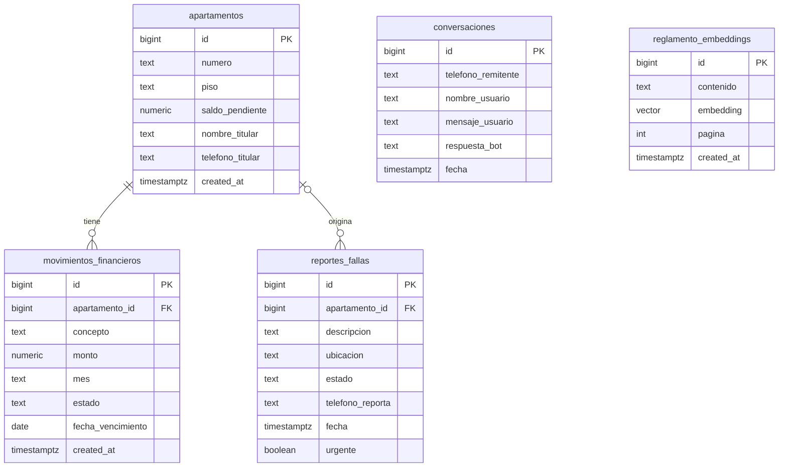

# Base de datos

El proyecto usa **Supabase (PostgreSQL)** con la extensión **pgvector** para la búsqueda semántica del reglamento.

## Modelo de datos



`conversaciones` no tiene llave foránea: relaciona los mensajes con el residente por **número de teléfono** (`telefono_remitente`), que es el número de WhatsApp desde el que escribe.

## Tablas

| Tabla | Propósito | Quién la usa |
|---|---|---|
| `apartamentos` | Cada apartamento con su piso, titular, teléfono del titular y saldo pendiente. | Connie (consulta de saldo) y portal. |
| `movimientos_financieros` | Cargos y pagos de cada apartamento (concepto, monto, mes, estado y fecha de vencimiento). El portal recalcula el saldo al registrar cargos y pagos. | Portal. |
| `reportes_fallas` | Incidencias reportadas en áreas comunes, con estado y marca `urgente`. El `apartamento_id` es opcional: el reportante se identifica también por `telefono_reporta`. | Connie (inserta) y portal (gestiona el estado). |
| `conversaciones` | Historial de cada intercambio: mensaje del residente y respuesta de Connie. Los últimos 5 alimentan el contexto. | Connie. |
| `reglamento_embeddings` | Fragmentos de texto del reglamento con su embedding y la página de origen. | Connie (RAG) y portal (consulta). |

Connie registra las fallas con estado `Pendiente`; el valor por defecto de la tabla es `Abierto`.

## Esquema SQL

```sql
CREATE EXTENSION IF NOT EXISTS vector;

CREATE TABLE public.apartamentos (
  id bigint GENERATED ALWAYS AS IDENTITY NOT NULL,
  numero text NOT NULL,
  piso text NOT NULL,
  saldo_pendiente numeric NOT NULL DEFAULT 0.00,
  created_at timestamp with time zone NOT NULL DEFAULT timezone('utc'::text, now()),
  nombre_titular text,
  telefono_titular text,
  CONSTRAINT apartamentos_pkey PRIMARY KEY (id)
);

CREATE TABLE public.movimientos_financieros (
  id bigint GENERATED ALWAYS AS IDENTITY NOT NULL,
  apartamento_id bigint NOT NULL,
  concepto text NOT NULL,
  monto numeric NOT NULL,
  mes text NOT NULL,
  estado text NOT NULL DEFAULT 'Pendiente'::text,
  fecha_vencimiento date,
  created_at timestamp with time zone NOT NULL DEFAULT timezone('utc'::text, now()),
  CONSTRAINT movimientos_financieros_pkey PRIMARY KEY (id),
  CONSTRAINT movimientos_financieros_apartamento_id_fkey FOREIGN KEY (apartamento_id) REFERENCES public.apartamentos(id)
);

CREATE TABLE public.reportes_fallas (
  id bigint GENERATED ALWAYS AS IDENTITY NOT NULL,
  apartamento_id bigint,
  descripcion text NOT NULL,
  ubicacion text,
  estado text NOT NULL DEFAULT 'Abierto'::text,
  telefono_reporta text,
  fecha timestamp with time zone NOT NULL DEFAULT timezone('utc'::text, now()),
  urgente boolean DEFAULT false,
  CONSTRAINT reportes_fallas_pkey PRIMARY KEY (id),
  CONSTRAINT reportes_fallas_apartamento_id_fkey FOREIGN KEY (apartamento_id) REFERENCES public.apartamentos(id)
);

CREATE TABLE public.reglamento_embeddings (
  id bigint GENERATED ALWAYS AS IDENTITY NOT NULL,
  contenido text NOT NULL,
  embedding vector(1536),
  pagina integer,
  created_at timestamp with time zone NOT NULL DEFAULT timezone('utc'::text, now()),
  CONSTRAINT reglamento_embeddings_pkey PRIMARY KEY (id)
);

CREATE TABLE public.conversaciones (
  id bigint GENERATED ALWAYS AS IDENTITY NOT NULL,
  telefono_remitente text NOT NULL,
  nombre_usuario text,
  mensaje_usuario text NOT NULL,
  respuesta_bot text NOT NULL,
  fecha timestamp with time zone DEFAULT now(),
  CONSTRAINT conversaciones_pkey PRIMARY KEY (id)
);
```

## Consultas principales

**Saldo de un apartamento** (sin distinguir mayúsculas):

```sql
SELECT numero, saldo_pendiente
FROM apartamentos
WHERE UPPER(numero) = UPPER($1);
```

**Registro de una falla:**

```sql
INSERT INTO reportes_fallas (descripcion, ubicacion, estado, telefono_reporta, fecha, urgente)
VALUES ($1, $2, 'Pendiente', $3, now(), $4);
```

**Historial reciente de un residente:**

```sql
SELECT mensaje_usuario, respuesta_bot, fecha
FROM conversaciones
WHERE telefono_remitente = $1
ORDER BY fecha DESC
LIMIT 5;
```

**Búsqueda semántica en el reglamento** (distancia coseno de pgvector; `$1` es el embedding de la pregunta):

```sql
SELECT contenido
FROM reglamento_embeddings
ORDER BY embedding <=> $1::vector
LIMIT 2;
```

Todas las consultas del workflow son parametrizadas.

## Embeddings

- Modelo: `gemini-embedding-001`
- Dimensiones: 1536
- Los fragmentos del reglamento y la pregunta del residente deben generarse con el mismo modelo y las mismas dimensiones. Si se cambia de modelo, hay que reindexar el reglamento.
