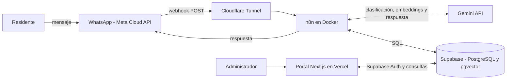
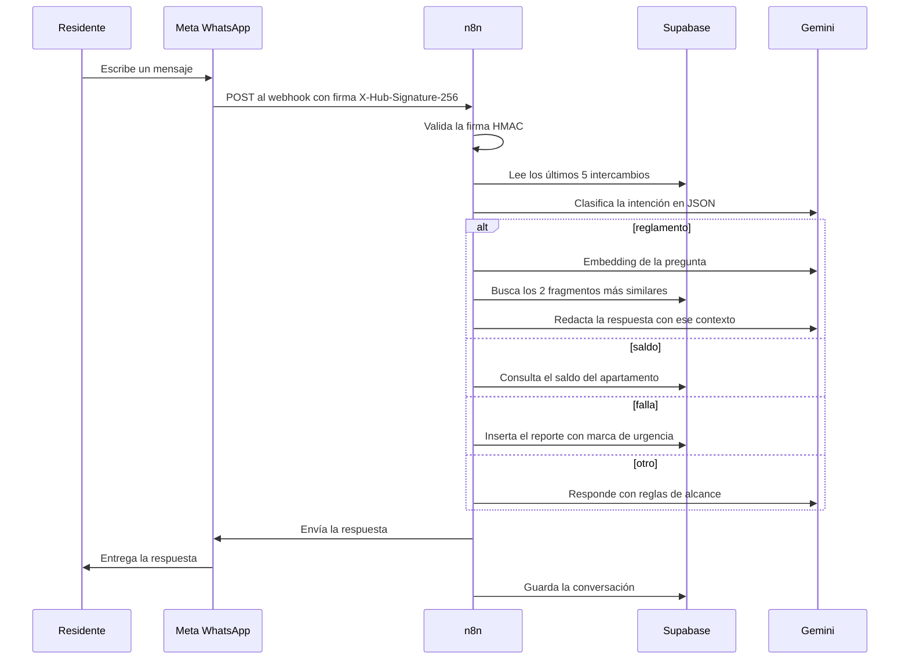

# Arquitectura

El sistema tiene dos experiencias: los **residentes** hablan con Connie por WhatsApp, y la **administración** gestiona el condominio desde un portal web. Ambas usan la misma base de datos en Supabase. La lógica de la conversación vive en un workflow de n8n, desacoplado del portal.

## Visión general

## Componentes

| Componente | Responsabilidad |
|---|---|
| **WhatsApp Cloud API** | Canal con el residente. Envía cada mensaje al webhook y entrega la respuesta. |
| **Cloudflare Tunnel** | Expone el n8n local a internet con HTTPS para que Meta lo alcance durante el desarrollo. |
| **n8n (Docker)** | Orquesta el flujo: valida, clasifica, enruta, consulta datos, llama al modelo y responde. |
| **Gemini API** | Clasifica la intención, genera los embeddings y redacta la respuesta final. |
| **Supabase** | PostgreSQL con pgvector: apartamentos, movimientos, incidencias, conversaciones y reglamento indexado. También autentica al portal. |
| **Portal (Next.js)** | Landing pública, login y dashboard administrativo desplegado en Vercel. |

## Flujo de un mensaje

## Enrutamiento por intención

| Intención | Qué hace | Usa el modelo para redactar |
|---|---|---|
| `reglamento` | Búsqueda semántica (RAG) en `reglamento_embeddings`. | Sí, con los fragmentos como contexto. |
| `saldo` | Consulta directa a `apartamentos` por número. | No: la respuesta se arma con el dato exacto de la base. |
| `falla` | Inserta en `reportes_fallas` con `urgente` verdadero o falso. | No: mensaje fijo, con aviso de contactar seguridad si es urgente. |
| `otro` | Sin contexto del reglamento. | Sí, con reglas de alcance y sin permiso para inventar datos. |

Los datos de saldo y de incidencias nunca los redacta el modelo: se leen de la base en cada mensaje, para no responder con información desactualizada.

## Decisiones de diseño

- **n8n separado del portal:** el flujo conversacional se puede modificar sin volver a desplegar el frontend.
- **Clasificador con temperatura 0:** ante el mismo mensaje devuelve siempre la misma categoría, y responde en JSON para poder enrutarlo.
- **RAG con pgvector:** las respuestas sobre el reglamento salen de fragmentos reales, no del conocimiento general del modelo.
- **Control de invenciones:** el prompt final solo permite afirmar datos que estén en el reglamento; si no aparecen, Connie lo dice y remite a la administración. La temperatura de generación es 0.3. Esta regla nació de una prueba en la que Connie inventó una dirección, y se corrigió y volvió a probar.
- **Formato para WhatsApp:** un nodo convierte el Markdown del modelo a la sintaxis de WhatsApp antes de enviar.
- **Respaldo ante fallos del modelo:** si Gemini no responde, Connie pide al residente repetir el mensaje en lugar de quedar en silencio.

## Seguridad

- Validación de la firma HMAC (`X-Hub-Signature-256`) de cada mensaje, con el App Secret de Meta.
- Credenciales en el almacén cifrado de n8n; el workflow exportado solo trae referencias.
- Consultas SQL parametrizadas.
- Portal protegido con Supabase Auth.

## Limitaciones

- El webhook depende del túnel y del equipo donde corre Docker; la URL del túnel rápido cambia cada vez que se reinicia y hay que actualizarla en Meta.
- La urgencia tiene dos niveles y no se notifica automáticamente a la administración.
- El saldo se entrega a quien indique un número de apartamento, sin comprobar que el teléfono le pertenezca.
